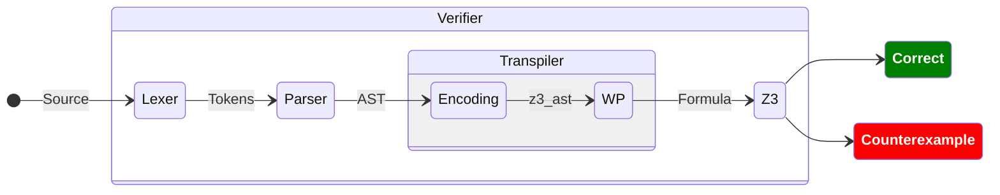

# Mini Dafny

[](https://github.com/xdward/mini-dafny/actions/workflows/ci.yml)
[](https://github.com/xdward/mini-dafny/actions/workflows/docs.yml)

A simple version of the [Dafny](https://dafny.org/) programming language, for verifying program specifications.

## Overview

This package contains a verification workflow for program specifications. It includes the
components necessary to read, validate, and convert a specification into an immediate
representation. The transpiler encodes statements into SMT instances that can be
formulized into a problem that can be solved by theorem provers such as
[Z3](https://github.com/Z3Prover/z3). The verifier either proves the correctness of the
specification or finds a counterexample that breaks the requirements.

Documentation for the language can be found
[here](https://xdward.github.io/mini-dafny/verifier/).



## Example

The specification shown below is for a program that copies `inp` to `out` through iterative
addition. It uses `x` and `y` as auxiliary variables and executes copying in three steps:

1. the value of `inp` is assigned to `x`
2. until it is zero, `x` is decremented and `y` is incremented
3. the value of `y` is assigned to `out`

In this specification, `inp` and `out` are *expected* to be equal under the *constraint* that the
value  of `x` is larger than or equal to zero.

```
var x, y, inp, out
assume 0 <= inp

x := inp
y := 0
while x > 0
invariant x >=0 && y + x == inp
    x := x - 1
    y := y + 1
end
out := y
out := out + 1

assert out == inp
```

This specification is processed by the verifier and generates the counterexample, `inp = 0`. This
means that the specification fails for the minimum required value for `inp`. This is because `out`
is incremented at the end. Removing the `out := out + 1` statement would make this
specification correct.

The example above can be found in [examples/copy.rs](examples/copy.rs). To run it locally, use:
`cargo run --example copy`.

## Usage

This package includes a binary that can be used to locally test specifications. Create a `.txt`
file for your specification under the root directory and verify it with the command below:

```
cargo run -- spec.txt
```

> [!IMPORTANT]
> A dynamic system library can also be built with the `cargo build --lib` command for
> external use. The library was developed with the intention of integrating it into a
> WebAssembly sandbox. This compatability hasn't been fully implemented yet.
