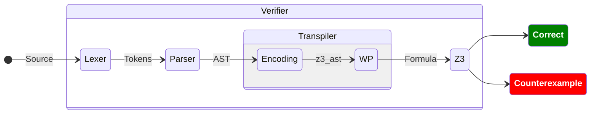

# Mini Dafny

[](https://github.com/xdward/mini-dafny/actions/workflows/ci.yml)
[](https://github.com/xdward/mini-dafny/actions/workflows/docs.yml)
[](https://github.com/xdward/mini-dafny/actions/workflows/wasm.yml)

A simple version of the [Dafny](https://dafny.org/) programming language, for verifying program specifications.

## Overview

This package contains a verification workflow for program specifications. It includes the
components necessary to read, validate, and convert a specification into an immediate
representation. The transpiler encodes statements into SMT instances that can be
formulized into a problem that can be solved by theorem provers such as
[Z3](https://github.com/Z3Prover/z3). The verifier either proves the correctness of the
specification or finds a counterexample that breaks the requirements.

Documentation for the language can be found
[here](https://xdward.github.io/mini-dafny/docs/verifier/).


```mermaid
stateDiagram
    direction LR

    classDef pass fill:green,color:white,font-weight:bold
    classDef fail fill:red,color:white,font-weight:bold

    [*] --> Lexer : Source
    state Verifier {
        direction LR
        Lexer --> Parser : Tokens
        Parser --> Encoding : AST
        state Transpiler {
            direction LR
            Encoding --> WP : z3_ast
            WP --> Z3 : Formula
        }
        Z3
    }
    Z3 --> Correct:::pass
    Z3 --> Counterexample:::fail
```

## Example

The specification shown below is for a program that copies `inp` to `out` through iterative
addition. It uses `x` and `y` as auxiliary variables and executes copying in three steps:

1. the value of `inp` is assigned to `x`
2. until it is zero, `x` is decremented and `y` is incremented
3. the value of `y` is assigned to `out`

In this specification, `inp` and `out` are _expected_ to be equal under the _constraint_ that the
value of `x` is larger than or equal to zero.

```
var x, y, inp, out
assume 0 <= inp

x := inp
y := 0
while x > 0
invariant x >=0 && y + x == inp
    x := x - 1
    y := y + 1
end
out := y
out := out + 1

assert out == inp
```

This specification is processed by the verifier and generates the counterexample, `inp = 0`. This
means that the specification fails for the minimum required value for `inp`. This is because `out`
is incremented at the end. Removing the `out := out + 1` statement would make this
specification correct.

The example above can be found in [examples/copy.rs](examples/copy.rs). To run it locally, use:
`cargo run --example copy`.

## Usage

Create a `.txt` file for your specification under the root directory and verify it with the
command below:

```sh
cargo run -- spec.txt
```

## Development

The project has two binaries: the default `verifier` binary for verifying specifications though
the command-line and `sandbox-wasm` binary for running a browser sandbox.

### `verifier` binary

The default binary is defined in [src/main.rs](src/main.rs) and will use the default build target
(the host architecture). Build it with either a debug or release build:

```sh
cargo build
cargo build --release
```

Run the default binary with a specification file as its only argument:

```sh
cargo run -- spec.txt
```

Run the test suite with:

```sh
cargo test
```

### `sandbox-wasm` binary

The [src/bin/sandbox-wasm.rs](src/bin/sandbox-wasm.rs) binary exposes the `Sandbox` object to
JavaScript through `wasm-bindgen`; it is built for the browser rather than run as a command-line
program. The `build-sandbox-wasm` alias from [`.cargo/config.toml`](.cargo/config.toml) builds the
`sandbox-wasm` binary with the `wasm32-unknown-emscripten` target and `--release` profile.

> [!IMPORTANT]
> The `vendored` feature is enabled for the [z3-sys](https://github.com/prove-rs/z3.rs) create. This
> feature builds and links Z3 from source. Due to this, the build duration sits at approximately
> **15-20 minutes**, depending on the host machine.

Before starting the build, install Emscripten and activate it in your current shell.

```sh
git clone https://github.com/emscripten-core/emsdk.git --depth 1
./emsdk/emsdk install latest
./emsdk/emsdk activate latest
source ./emsdk/emsdk_env.sh
```

Install the `wasm-unknown-emscripten` target and `wasm-bindgen-cli`. When installing the CLI, you
must flag the **exact** version that is used by the `wasm-bindgen` create in
[`Cargo.lock`](Cargo.lock). For convenience, [`Cargo.toml`](Cargo.toml) pins the create version for
`wasm-bindgen`.

```sh
rustup target add wasm32-unknown-emscripten
cargo install wasm-bindgen-cli --version <version>
```

Set the C/C++ compiler flags and run the alias for the WASM build.

```sh
export CFLAGS="-fwasm-exceptions"
export CXXFLAGS="-fwasm-exceptions"
cargo build-sandbox-wasm --verbose
```

```sh
test -s target/wasm32-unknown-emscripten/release/deps/sandbox_wasm.js
test -s target/wasm32-unknown-emscripten/release/deps/sandbox_wasm.wasm
test -s target/wasm32-unknown-emscripten/release/sandbox_wasm.wasm
```

[^1]: https://doc.rust-lang.org/nightly/rustc/platform-support/wasm32-unknown-emscripten.html
[^2]: https://wasm-bindgen.github.io/wasm-bindgen/reference/emscripten.html
